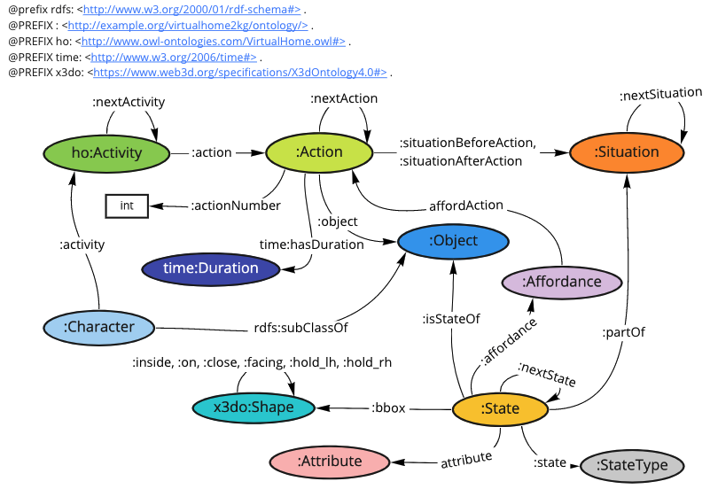

# Ontology

The [vh2kg_ontology.ttl](vh2kg_ontology.ttl) is our ontology. 
Following figure shows the summarized class relation diagram of the designed ontology.

We reused a part of the [HomeOntology](https://github.com/valexande/HomeOntology) for representing activities. 

## Prefix 
| Prefix | URI                                                  |
|--------|------------------------------------------------------|
| :      | http://example.org/virtualhome2kg/ontology/          |
| ho:    | http://www.owl-ontologies.com/VirtualHome.owl#       |
| time:  | http://www.w3.org/2006/time#                         |
| x3do   | https://www.web3d.org/specifications/X3dOntology4.0# |
 

## Description of major classes 

| QName         | Description                                                                                                                                                                                                                                                   |
|---------------|---------------------------------------------------------------------------------------------------------------------------------------------------------------------------------------------------------------------------------------------------------------|
| ho:Activity   | Human daily activity at home. This class is reused from the HomeOntology.                                                                                                                                                                                     |
| :Action       | Fine-grained event to compose the activity. This class is defined based on instances of StepType class in HomeOntology.                                                                                                                                       |
| :Object       | Object in a home such as food, furniture, electronics, consumables, and living thing.                                                                                                                                                                         |
| :Situation    | Situation in a home at a certain time.                                                                                                                                                                                                                        |
| :State        | State of an object at a certain time.                                                                                                                                                                                                                         |
| :StateType    | Type of state. The instances of this class are based on [object states](https://github.com/xavierpuigf/virtualhome/tree/master/simulation#object-states) of VirtualHome.                                                                                      |
| :Attribute    | Attribute of an object. Because both attributes and affordances of objects are mixing in the [object properties](https://github.com/xavierpuigf/virtualhome/tree/master/simulation#object-properties) in the VirtualHome, we classified it into two classes.  |
| :Affordance   | Affordance of an object. Because both attributes and affordances of objects are mixing in the [object properties](https://github.com/xavierpuigf/virtualhome/tree/master/simulation#object-properties) in the VirtualHome, we classified it into two classes. |
| :Shape        | Object's 3D bounding box, including size and coordinates. This class is reused from the [X3D ontology](https://www.web3d.org/x3d/content/semantics/semantics.html).                                                                                                                       |
| time:Duration | Duration of an execution of an action. This class is reused from the [Time Ontology](https://www.w3.org/TR/owl-time/#time:Duration).                                                                                                                          |
 
 
## Description of properties 

| QName                  | Domains     | Ranges        | Description                                                                                                                                                                                                                                                                                                                          |
|------------------------|-------------|---------------|--------------------------------------------------------------------------------------------------------------------------------------------------------------------------------------------------------------------------------------------------------------------------------------------------------------------------------------|
| :activty               | :Character  | :Activity     | Associates a character (agent) to activities.                                                                                                                                                                                                                                                                                        |
| :action                | :Activity   | :Action       | Associates an activity to actions. The activity is composed of an action sequence.                                                                                                                                                                                                                                                   |
| :actionNumber          | :Action     | xsd:int       | Indicates the order of the action in the activity.                                                                                                                                                                                                                                                                                   |
| :situationBeforeAction |             | :Situation    | Subproperty of :relatedSituation. Associates an action to a situation. Environmental situation before executing some action.                                                                                                                                                                                                         |
| :situationAfterAction  |             | :Situation    | Subproperty of :relatedSituation. Associates an action to a situation. Environmental situation after executing some action.                                                                                                                                                                                                          |
| ho:object              | :Action     | :Object       | Associates an action to a target object. This property is reused and modified from the HomeOntology.                                                                                                                                                                                                                                 |
| time:hasDuration       | :Action     | time:Duration | Associates an action to its execution duration.                                                                                                                                                                                                                                                                                      |
| :isStateOf             | :State      | :Object       | Associates an object to its state.                                                                                                                                                                                                                                                                                                   |
| :state                 | :State      | :StateType    | Associates a state to its values.                                                                                                                                                                                                                                                                                                    |
| :affordance            | :State      | :Affordance   | Associates a state to object's affordances                                                                                                                                                                                                                                                                                           |
| :attribute             | :State      | :Attribute    | Associates a state to attributes of an object.                                                                                                                                                                                                                                                                                       |
| :partOf                | :State      | :Situation    | In this ontology, the :partOf property is used for associating a state to a situation.                                                                                                                                                                                                                                               |
| :bbox                  | :State      | :Shape        | Associates a state to a 3D bounding box of an object.                                                                                                                                                                                                                                                                                |
| :affordAction          | :Affordance | :Action       | Associates an affordance to a related action.                                                                                                                                                                                                                                                                                        |
| :nextActivity          | :Activity   | :Activity     | Subproperty of :relatedActivity. Associates an activity to the next activity. This property is usually used for KG that is augmented by our method.                                                                                                                                                                                  |
| :nextAction            | :Action     | :Action       | Subproperty of :relatedAction. Associates an action to the next action.                                                                                                                                                                                                                                                              |
| :nextSituation         | :Situation  | :Situation    | Subproperty of :relatedSituation. Associates a situation to the next situation.                                                                                                                                                                                                                                                      |
| :nextState             | :State      | :State        | Subproperty of :relatedState. Associates a state to the next state.                                                                                                                                                                                                                                                                  |
| :between               | :Shape      | :Shape        | Subproperty of :relatedShape. Please see [detailed description](https://github.com/xavierpuigf/virtualhome/tree/master/simulation#relations). This property is used for door objects. If a door is between a kitchen and a living room, this property associates the door to the living room and associates the door to the kitchen. |
| :close                 | :Shape      | :Shape        | Subproperty of :relatedShape. Please see [detailed description](https://github.com/xavierpuigf/virtualhome/tree/master/simulation#relations). Triple <object1, close, object2> denotes that the distance between center of object1 (object2) to the bounding box of object2 (object1) is < 1.5 units (~meters).                      |
| :facing                | :Shape      | :Shape        | Subproperty of :relatedShape. Please see [detailed description](https://github.com/xavierpuigf/virtualhome/tree/master/simulation#relations). Triple <object1, facing, object2> denotes that object2 is lookable, is visible from object1, and the distance between the centers is < 5 units (~meters).                              |
| :holds_lh              | :Shape      | :Shape        | Subproperty of :relatedShape. Please see [detailed description](https://github.com/xavierpuigf/virtualhome/tree/master/simulation#relations). Relation for left hand.                                                                                                                                                                |
| :holds_rh              | :Shape      | :Shape        | Subproperty of :relatedShape. Please see [detailed description](https://github.com/xavierpuigf/virtualhome/tree/master/simulation#relations). Relation for left hand.                                                                                                                                                                |
| :inside                | :Shape      | :Shape        | Subproperty of :relatedShape. Triple <object1, inside, object2> denotes that object1 is placed inside of object2.                                                                                                                                                                                                                    |
| :on                    | :Shape      | :Shape        | Subproperty of :relatedShape. Triple <object1, on, object2> denotes that object1 is placed on object2.                                                                                                                                                                                                                               |
