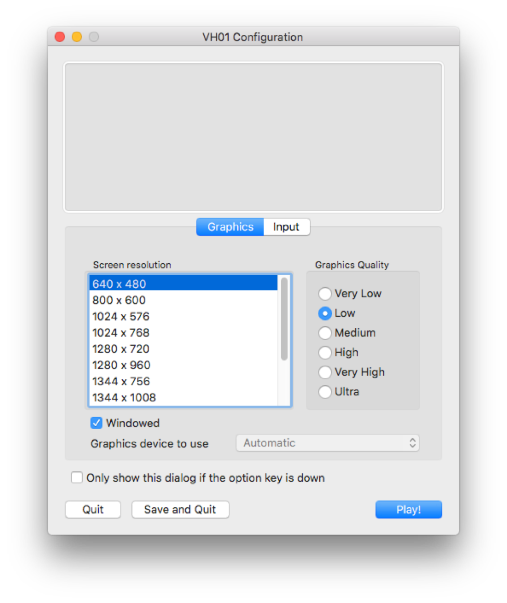
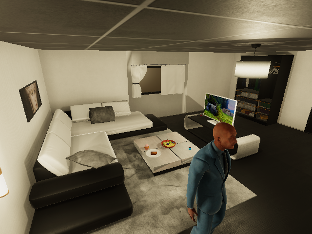
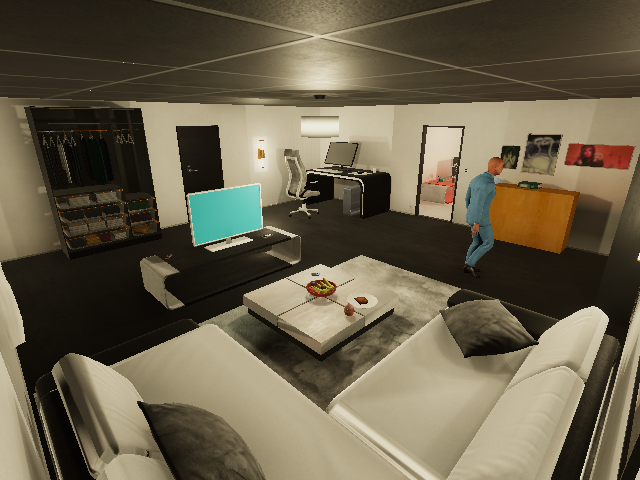
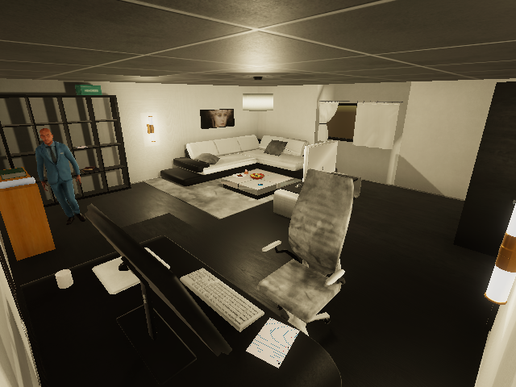
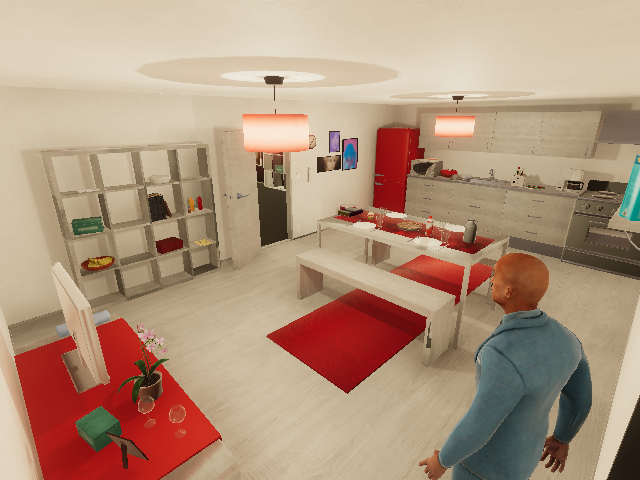
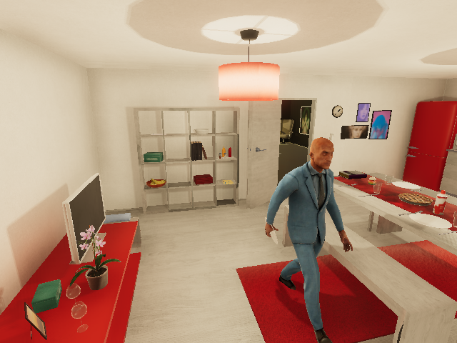
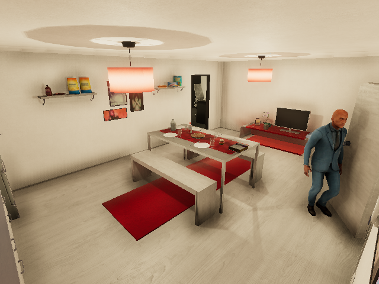
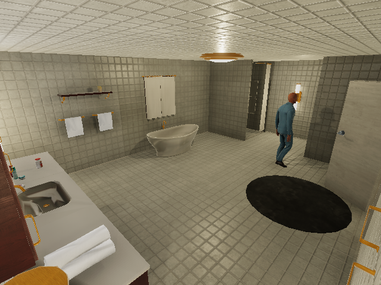
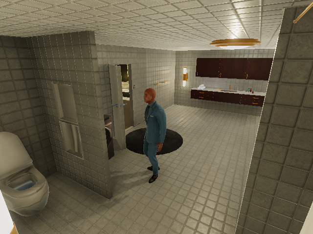

# Unity Simulator
## Quickstart
To start running the simulator, make sure the Unity Executable is running (use the desktop version or docker). If using the desktop version, make sure you select windowed and run **Play!** as shown in the screenshot.



You can now run the simulator with the python API. Start the communication with the executable:

```python
from comm_unity import UnityCommunication
comm = UnityCommunication()
```

Render a simple video, saved in [output](output) folder.

```python
comm.reset()
script = [
	'[Walk] <chair> (1)',
	'[Sit] <chair> (1)'
]
comm.render_script(script)

```


Check the notebook [demo](../../demo/unity_demo.ipynb) to further explore the simulator.


## Modification of render_script (Recorded on 2023/04/21)
Based on the simulator Build_2023_0404, three new camera modes are added. They are SPECIFIED, DIAGONAL1 and DIAGONAL2.
### SPECIFIED
SPECIFIED camera mode will serve the same functionalities as AUTO mode. It makes only differences that in this mode, we can set our desired camera indexes fewer and more precise camera views than AUTO with an additional param called 'specified_cameras'. For example,

```python
from comm_unity import UnityCommunication
comm = UnityCommunication()

comm.render_script(
	...
	camera_mode=['SPECIFIED'],
	specified_cameras=[67,86,88,43,64,66],
	...
	)
```
It will result one video with the following camera switches:




### DIAGONAL1 and DIAGONAL2
Since there are new four cameras placed on each top corners of each room, we can use two of them in our program. We need to decide in advance which camera indexes will we use. It would be better choose two diagonal cameras since it is the purpose of this mode.
We have to set two additional params for this modes, diagonal_cameras1 and diagonal_cameras2, and the important thing is we need to set each indexes in each params for a room. For example, Let's suppose there will be indexes 13 and 15. And they are two diagonal cameras of bathroom. Then, we need to set the params like this:

```python
from comm_unity import UnityCommunication
comm = UnityCommunication()

comm.render_script(
	...
	camera_mode=['DIAGONAL1', 'DIAGONAL2'],
	diagonal_cameras1=[13],
	diagonal_cameras2=[15],
	...
	)
```
It will result two videos in the following views:



For further reference, please check this notebook [ref](../../demo/scenario_generate_graph_and_video_with_cameras_changes.ipynb)